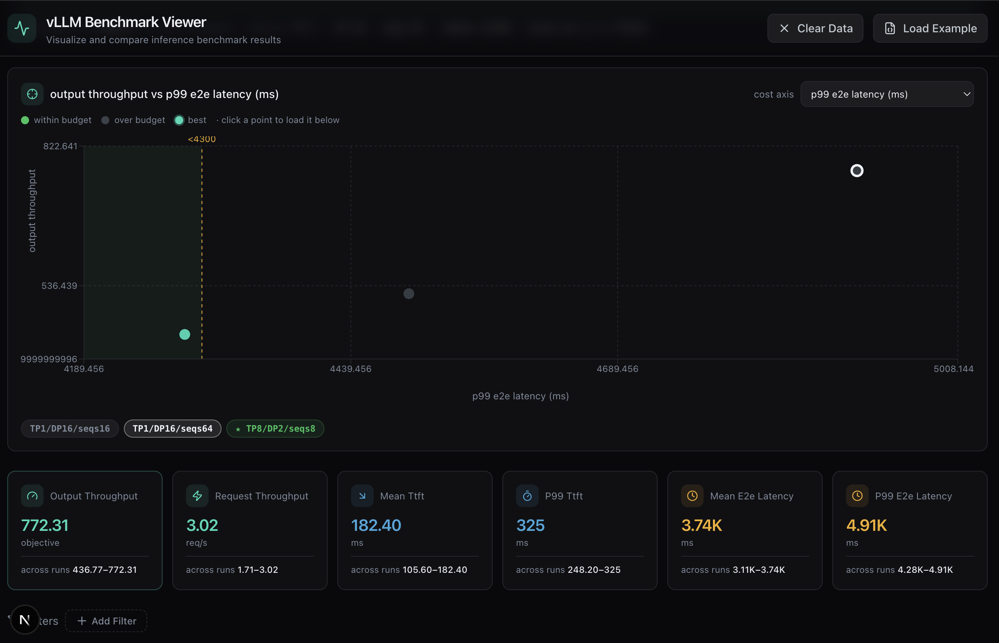

# LLM Optimizer

llm-optimizer is a Python tool for benchmarking and optimizing inference performance of any open-source LLMs.

- 🧩 Benchmark across inference frameworks like SGLang and vLLM using their native arguments
- ⚡️ Find the optimal setup automatically for your use case without endless trial and error
- 🎯 Apply SLO constraints to focus only on configurations that meet your performance goals
- 🧮 Estimate performance theoretically without running full benchmarks
- 📊 Visualize results interactively with dashboards for clear analysis

[](https://www.bentoml.com/blog/announcing-llm-optimizer)
[](https://www.bentoml.com/llm-perf)

Interested in optimizing disaggregated LLM inference? [👉 Contact us](https://www.bentoml.com/contact)

## Installation

Install llm-optimizer with `pip`.

```bash
pip install -e .
```

For development:
```bash
pip install -e .[dev]
```

## Get started

The quickest way to try llm-optimizer is with performance estimation. This feature predicts latency, throughput, and concurrency limits, helping you identify optimal configurations without running full benchmarks:

```bash
llm-optimizer estimate \
  --model meta-llama/Llama-3.1-8B-Instruct \
  --gpu A100 \  # No need to provide gpu type if llm-optimizer can detect the local machine's GPU type and it's supported
  --input-len 1024 \
  --output-len 512
```

> [!NOTE]
> For gated models, request access on Hugging Face and export your token in advance:
> ```bash
> export HF_TOKEN=<your token>
> ```

More examples:

```bash
# With GPU specification
llm-optimizer estimate \
  --model meta-llama/Llama-3.1-8B-Instruct \
  --input-len 2048 \
  --output-len 1024 \
  --gpu H100 \
  --num-gpus 8

# With performance constraints and command generation
llm-optimizer estimate \
  --model meta-llama/Llama-3.1-8B-Instruct \
  --input-len 1024 \
  --output-len 512 \
  --gpu H100 \
  --num-gpus 4 \
  --constraints "ttft:mean<300ms;itl:p95<50ms"
```

For guided setup, you can also use interactive mode:

```bash
llm-optimizer estimate --interactive
```

## Run your first benchmark

Currently, llm-optimizer supports benchmarking with SGLang and vLLM to test different configurations of an LLM.

Here is an example using SGLang:

```bash
# SGLang with multiple TP/DP combinations
llm-optimizer \
  --framework sglang \
  --model meta-llama/Llama-3.1-8B-Instruct \
  --server-args "tp_size*dp_size=[(1,4),(2,2),(4,1)];chunked_prefill_size=[2048,4096,8192]" \
  --client-args "max_concurrency=[50,100,200];num_prompts=1000" \
  --output-json sglang_results.json
```

This command will:

- Test 3 TP/DP combinations × 3 prefill sizes = 9 server configurations
- Test each against 3 concurrency values = 27 client configurations
- In total, 27 unique benchmarks will be run, with results saved in `sglang_results.json`

More examples:

```bash
# vLLM with batch size tuning
llm-optimizer \
  --framework vllm \
  --model meta-llama/Llama-3.1-8B-Instruct \
  --server-args "tensor_parallel_size*data_parallel_size=[(1,2),(2,1)];max_num_batched_tokens=[4096,8192,16384]" \
  --client-args "max_concurrency=[32,64,128];num_prompts=1000;dataset_name=sharegpt" \
  --output-json vllm_results.json

# Complex parameter grid for throughput optimization
llm-optimizer \
  --framework sglang \
  --model meta-llama/Llama-3.1-8B-Instruct \
  --server-args "tp_size*dp_size=[(1,8),(2,4),(4,2)];schedule_conservativeness=[0.3,0.6,1.0];chunked_prefill_size=range(2048,8193,2048)" \
  --client-args "max_concurrency=range(50,201,50);request_rate=[10,20,50]" \
  --gpus 8 \
  --output-json complex_benchmark.json
```

## Apply constraints

Not every benchmark result is useful. You can apply constraints directly to your benchmarks so only configurations that meet your Service Level Objectives (SLOs) are returned.

```bash
# Latency-optimized configuration
llm-optimizer \
  --framework vllm \
  --model meta-llama/Llama-3.1-8B-Instruct \
  --server-args "tensor_parallel_size*data_parallel_size=[(1,2),(2,1)];max_num_seqs=[16,32,64]" \
  --client-args "max_concurrency=[8,16,32];num_prompts=500" \
  --constraints "ttft<200ms;itl:p99<10ms" \
  --output-json latency_optimized.json
```

Currently llm-optimizer supports constraints on key performance metrics using mean, median, p95, or p99 values. Constraint syntax:

```bash
# Time to first token constraints
--constraints "ttft<300ms"                    # Mean TTFT under 300ms
--constraints "ttft:median<200ms"             # Median TTFT under 200ms
--constraints "ttft:p95<500ms"                # 95th percentile under 500ms

# Inter-token latency constraints
--constraints "itl:mean<20ms"                 # Mean ITL under 20ms
--constraints "itl:p99<50ms"                  # 99th percentile under 50ms

# End-to-end latency constraints
--constraints "e2e_latency:p95<2s"           # 95th percentile under 2s

# Combined constraints
--constraints "ttft:median<300ms;itl:p95<10ms;e2e_latency:p95<2s"
```

## Visualize benchmark results

llm-optimizer saves benchmark results in JSON format, including key inference metrics like TTFT, ITL, and concurrency. Since raw numbers can be difficult to interpret, it provides an interactive visualization tool to help you explore results more easily.

```bash
# Visualize results with Pareto frontier analysis
llm-optimizer visualize --data-file results.json --port 8080

# Combine multiple result files
llm-optimizer visualize --data-file "sglang_results.json,vllm_results.json" --port 8080
```

Open your browser at `http://localhost:8080/pareto_llm_dashboard.html`. The dashboard allows you to:

- Compare results from multiple runs side by side
- Explore trade-offs between different setups (e.g., latency vs. throughput)
- Identify the best-performing configurations for your workload

> [!NOTE]
> This feature is still experimental, and we’ll continue improving it in the coming days. For visualized results, check out the [LLM Performance Explorer](https://www.bentoml.com/llm-perf/).

### Results viewer

`viewer/` is a web UI for picking a configuration out of a sweep. Where the
Pareto dashboard plots the runs and leaves you to work out which point you can
ship, this one takes your budget as input and answers directly.



Three Trainium2 configurations against a `p99 e2e latency < 4300 ms` budget: the
run inside it is green, the two outside are grey, and the starred chip marks the
winner. The cards describe whichever point you click.

```bash
cd viewer
pnpm install
pnpm dev
```

Open `http://localhost:3000` and drop in your results. It reads every shape the
CLI writes:

- `results.jsonl` — appended after each run, so you can watch a sweep in progress
- `results.json` — the aggregated file written at the end
- a single `<config_id>.json` from `--output-dir`, or an array of records

`viewer/public/sample-trn2.jsonl` is a sample Trainium2 sweep if you want to see
it populated before running anything. You can also deep-link a file served from
the app: `http://localhost:3000/?data=/sample-trn2.jsonl`.

**Picking a winner.** State the objective and the budget it has to fit inside:

> Maximize `output_throughput` subject to `mean_ttft_ms < 150`

Both sides accept any numeric metric in the results, budgets stack, and the
answer updates without re-running anything. `--constraints` from the benchmark
run seed the initial budget but stay editable. The viewer reports what the
budget cost you — e.g. that dropping to a 150 ms TTFT gives up 32% of
throughput — and says so plainly when no run fits.

**Reading the sweep.** Every run is plotted as cost against benefit, with your
budget drawn on the chart as a shaded region. Runs outside it are greyed, the
winner is highlighted, and clicking any point loads that run into the detail
cards below. The results table carries every metric the benchmark client
produces (mean/median/std/p95/p99 for TTFT, ITL, TPOT and E2E) and any of them
can be sorted, filtered, or used as an axis.

AWS Neuron runs are labelled automatically, and the vLLM Neuron plugin’s
`--additional-config` is unpacked so the compiled bucket counts are sortable
columns rather than one long JSON string. Pass `--gpu trn2.48xlarge` when
benchmarking so the SKU is recorded — NVML cannot identify Neuron devices.

## Use custom server commands

By default, llm-optimizer manages server startup for supported frameworks. If you want more control, you can provide your own server command.

```bash
# Custom SGLang server
llm-optimizer \
  --server-cmd "python3 -m sglang.launch_server --model-path meta-llama/Llama-3.1-8B-Instruct --host 0.0.0.0 --port 30000" \
  --client-args "max_concurrency=[25,50,100];num_prompts=1000" \
  --host 0.0.0.0 \
  --port 30000

# Custom vLLM server with specific GPU allocation
llm-optimizer \
  --server-cmd "vllm serve meta-llama/Llama-3.1-8B-Instruct --tensor-parallel-size 4" \
  --client-args "max_concurrency=[64,128];num_prompts=2000" \
  --port 8000
```

## Tune inference parameters

llm-optimizer exposes both server- and client-side parameters so you can experiment with different setups and measure their impact on performance. It uses native parameters from the respective frameworks (currently support vLLM and SGLang). Here are some common parameters and you can add others as needed.

### SGLang
- `tp_size*dp_size`: Tensor/Data parallelism combinations
- `chunked_prefill_size`: Prefill chunk size for throughput
- `schedule_conservativeness`: Request scheduling aggressiveness
- `schedule_policy`: Scheduling policy (fcfs, priority)

### vLLM
- `tensor_parallel_size`: Tensor parallelism degree
- `max_num_batched_tokens`: Maximum batch size in tokens
- `max_num_seqs`: Maximum concurrent sequences

### Client parameters
- `max_concurrency`: Maximum concurrent requests
- `num_prompts`: Total number of requests to send
- `dataset_name`: Dataset for request generation (`sharegpt`, `random`)
- `random_input/random_output`: Random sequence lengths

### Supported Accelerators

**NVIDIA GPUs:** H100, H200, A100, A100-40GB, L20, L40, B100, B200 with accurate TFLOPS
specifications.

**AWS Neuron:** `trn1.2xlarge`, `trn1.32xlarge`, `trn1n.32xlarge`, `inf2.xlarge`,
`inf2.8xlarge`, `inf2.24xlarge`, `inf2.48xlarge`, `trn2.3xlarge`, `trn2.48xlarge`,
`trn2u.48xlarge`, `trn2-ultraserver`, `trn3u.gen1`, `trn3u.gen2`.

Specs are stored per accelerator, so `--num-gpus` is the number of chips/devices to use.
Since Neuron devices aren't visible to NVML, it defaults to the full chip count published
for the SKU (16 for `trn2.48xlarge`, 64 for `trn3u.gen1`, 144 for `trn3u.gen2`).

### Serving on AWS Neuron

Trainium and Inferentia are served through the
[vLLM Neuron plugin](https://github.com/vllm-project/vllm-neuron). It keeps the
`vllm serve` CLI, so `--framework vllm` on a Neuron SKU automatically resolves to the
`vllm-neuron` framework, which differs in what it tunes:

- Neuron compiles one graph per shape ahead of time, so every configuration carries an
  `--additional-config` with `num_batched_tokens_buckets` and `num_seqs_buckets` pinned to
  that config's `max_num_batched_tokens` and `max_num_seqs`.
- Tensor parallel degrees are restricted to powers of two.
- `block_size` is swept over 16 and 32, defaulting to Neuron's 32 rather than vLLM's 16.
- Arguments the plugin does not implement (pipeline parallelism, chunked prefill, LoRA,
  sleep mode, CPU offload) are dropped from the tunable surface.

SGLang and MAX have no Neuron backend and are skipped on these devices.

`tests/test_vllm_neuron.py` checks the generated configurations against the plugin's own
bucket validators. Point `VLLM_NEURON_SRC` at a vllm-neuron checkout to run those checks
without installing vLLM:

```bash
VLLM_NEURON_SRC=/path/to/vllm-neuron pytest tests/test_vllm_neuron.py
```

### Benchmarking on AWS Neuron

Neuron compiles the model to fixed-shape NEFFs on first start, which takes tens
of minutes. Two adjustments make a sweep practical, both automatic:

- **The server readiness wait** defaults to 5400 s when `--gpu` names a Neuron
  SKU, instead of the usual 300 s. Override with `--server-timeout`.
- **Runs are grouped by the shape they compile to.** Server arguments decide the
  NEFF set; concurrency and sequence lengths only select among already-compiled
  buckets. So runs that differ only in client arguments share one server, and a
  sweep of 3 shapes × 4 concurrencies compiles 3 times rather than 12. Use
  `--dry-run` to see how many shapes a sweep resolves to before running it.

Export `NEURON_COMPILED_ARTIFACTS` to a persistent path so later sweeps over the
same shapes skip compilation:

```bash
export NEURON_COMPILED_ARTIFACTS=~/neuron-cache/my-model

llm-optimizer \
  --framework vllm \
  --model Qwen/Qwen3-30B-A3B \
  --gpu trn2.48xlarge \
  --gpus 16 \
  --server-args "max_num_seqs=[16,64];max_num_batched_tokens=[8192,16384]" \
  --client-args "max_concurrency=[1,8,32]" \
  --output-json results.json
```

A shared server carries its prefix cache between runs, which flatters the later
runs' TTFT, so prefix caching is disabled when a server is reused. Set
`enable_prefix_caching` in `--server-args` to override.

**Installing alongside the plugin.** llm-optimizer does not depend on
`vllm-neuron` — the plugin installs from the AWS Neuron pip index, and the
`vllm-neuron` package on PyPI is an unrelated placeholder. Install llm-optimizer
into the environment that already has the plugin, such as the vLLM Inference
NeuronX DLC or the Neuron DLAMI venv:

```bash
source /opt/aws_neuronx_venv_pytorch_inference_vllm_0_21_0_1_0_0/bin/activate
pip install -e .
```

llm-optimizer's dependencies are unpinned so this does not disturb the pins that
environment already has (`vllm==0.24.0`, `transformers>=5.5.1,<6.0.0`).

For which parameters to sweep in the first place, and why the Neuron scheduler
inverts some standard vLLM advice, see
[docs/neuron-tuning.md](docs/neuron-tuning.md).

## Development

```bash
# Code formatting and linting
ruff format
ruff check

# Type checking
mypy src/
```

## Community

llm-optimizer is actively maintained by the BentoML team. Feel free to reach out and [join our Slack community!](https://l.bentoml.com/join-slack)

## Contributing

As an open-source project, we welcome contributions of all kinds, such as new features, bug fixes, and documentation. Here are some of the ways to contribute:

- Repost a bug by [creating a GitHub issue](https://github.com/bentoml/llm-optimizer/issues/new/choose).
- [Submit a pull request](https://github.com/bentoml/llm-optimizer/compare) or help review other developers’ [pull requests](https://github.com/bentoml/llm-optimizer/pulls).


## Acknowledgements

This project uses the following open-source projects:

- [vllm-project/vllm](https://github.com/vllm-project/vllm) for production level LLM backend and benchmark client codes
- [sgl-project/sglang](https://github.com/sgl-project/sglang) for production level LLM backend and benchmark client codes

We are grateful to the developers and contributors of these projects for their hard work and dedication.
